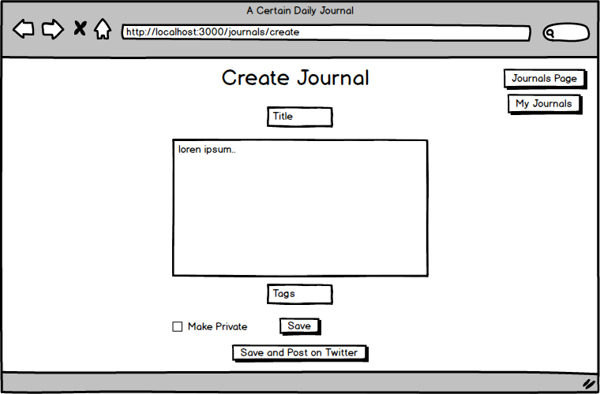
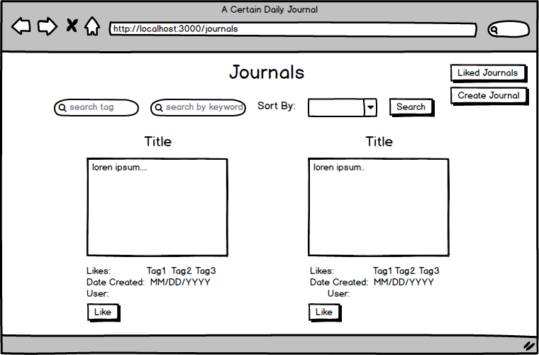
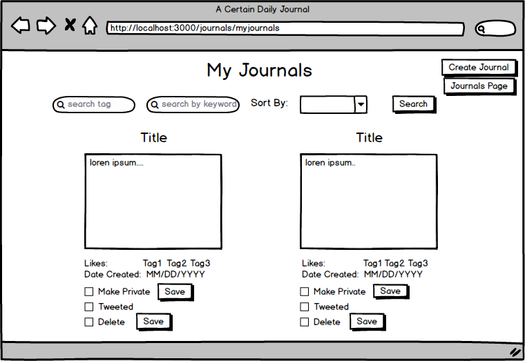
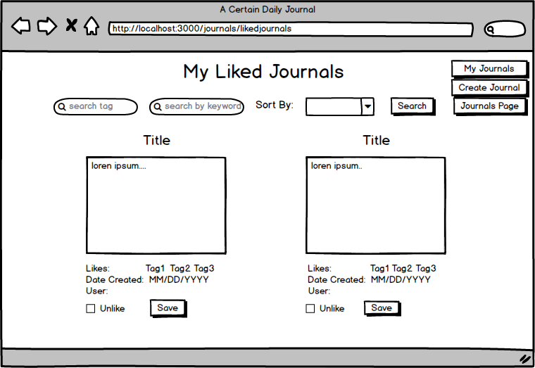
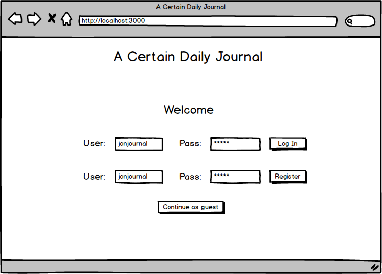
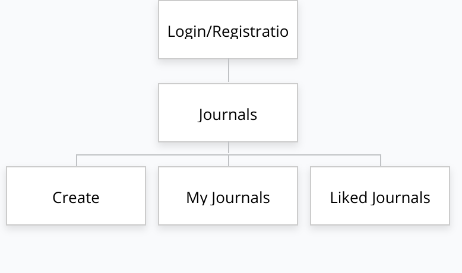

# A Certain Daily Journal

## Overview

Say you wanted to write a journal on your device, but you worry about it getting deleted. Or say you wanted to find other users journals on their daily lives but don't want to scroll through many social media posts to find them. A Certain Daily Journal gives the solution to that.

A Certain Daily Journal will allow the user to register and login with the site to create their journals. Additionally, when creating journals, the user has the option to save them privately or save them publicly. Anonymous users can still enter the site as a guest but are only able to view journals.


## Data Model

The application will store Users, Journals and a user's created journals

* users can have multiple likes and journals (via references)


An Example User:

```javascript
{
  username: "joejournal",
  hash: // a password hash,
  salt: // salt added to the password hash
  journal: // an array of references to the users's created journals
  likes: // an array of references to the user's liked journals  **SCRAPPED**
}
```

An Example Journal on the Journals Page:

```javascript
{
  title: "A Day at the Beach",
  body: "I had a wonderful day at the beach with my best friends",
  tags:, // array of tags
  likes:, // number of likes **SCRAPPED**
  isPrivate: false, // will be false since it's a public journal
  createdAt: // timestamp
}
```

An Example Journal on the MyJournals Page:

```javascript
{
  title: "A Day at the Beach",
  body: "I had a wonderful day at the beach with my best friends",
  tags:, // array of tags
  likes:, // number of likes **SCRAPPED**
  isPrivate:, // will be false or true depending on the user's choice
  createdAt: // timestamp
}
````

## [Link to Commented First Draft Schema](db.js) 


## Wireframes

/journals/create - page for creating a new journal



/journals - page for showing all public journals



/journals/myjournals - page for showing user's created journals



/journals/likedjournals - page for showing user's liked journals



/ - login/registration page



## Site map

site map:



## User Stories or Use Cases

1. as non-registered user, I can register a new account with the site
2. alternatively as a guest, I can enter the site and look at the journals without being able to create a journal
2. as a user, I can log in to the site
3. as a user, I can create a new journal and make it private
4. as a user, I can view all of the journals I've created
5. as a user, I can like other users' journals **Scrapped**
6. as a user, I can view my liked journals on another page **Scrapped**
7. as a user, I can filter public journals by searching for tag and title.
## Research Topics

* (3 points) Integrate user authentication
    * I'm going to be using passport for user authentication
    * I want to use passport since it seems to integrate with node js applications. So this can help ease the authentication process.
* (3 points) Perform client side form validation using a JavaScript library
    * Provide a clean, visual way to validate if the user filled in all the necessary fields, such as title and body.
    * Possible libraries include Parsley, Just-validate, or popup-validate 
* (2 points) Use bootstrap to help make my app look more visually appealing
    * Making css by scratch can be too time consuming, therefore I can use bootstrap to provide a useful css template so that I can add a couple of css rules to help make my site look more presentable

Note: Scratched the Twitter API idea as trying to learn it became more cumbersome and time-consuming than I expected.


## [Link to Initial Main Project File](app.js) 

## [Link to File for my research topic on custom validation](public/views/create.hbs)

Note: Proof of work can also be seen on journals/create

## Annotations / References Used

1. [passport.js authentication docs](http://passportjs.org/docs) - (Used passport-local) 
[Link to source for passport](passport/passport.js)
Additional use of passport on lines 158-168 on app.js (Logins Work)
2. [Just-validate.js docs](https://www.npmjs.com/package/just-validate)


